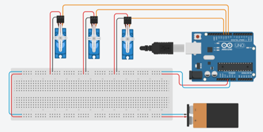

# robotic-pick-and-place-arm
Arduino-controlled robotic arm designed to automatically pick up an object, transport it to another position, and release it.

<p align="center">
  
</p>

## Overview

The objective of this project was to design and build a robotic manipulator capable of performing an automated pick-and-place operation.

The system uses multiple actuators to control the movement of the arm, the rotation of the base, and the opening and closing of the gripper.

The robot follows a predefined motion sequence that allows it to pick up an object, rotate toward another position, place the object, and return to its initial position.

## Key Features

- Automated pick-and-place operation
- Multi-axis robotic movement
- Servo-controlled joints
- Stepper-controlled base rotation
- Custom mechanical structure
- Custom gripper
- Arduino-based motion control
- C/C++ programming
- Physical robotics prototype

## System Architecture

```text
                 +-------------+
                 |   Gripper   |
                 +------+------+
                        |
                     Servo 3
                        |
                        v
                   Upper Arm
                        |
                     Servo 2
                        |
                        v
                   Lower Arm
                        |
                     Servo 1
                        |
                        v
                 Rotating Base
                        |
                   Stepper Motor
                        |
                        v
                     Arduino
```

## Hardware

- Arduino
- Three servo motors
- Stepper motor
- Breadboard
- Jumper wires
- Custom wooden mechanical structure
- Custom gripper mechanism

## Mechanical Design

The robotic arm was constructed as an articulated mechanical prototype.

Multiple servo motors control the arm joints and gripper while a stepper motor provides rotation at the base.

<p align="center">
  
</p>

## Motion Sequence

The robot performs a predefined sequence:

```text
HOME
  |
  v
APPROACH OBJECT
  |
  v
CLOSE GRIPPER
  |
  v
LIFT OBJECT
  |
  v
ROTATE BASE
  |
  v
LOWER OBJECT
  |
  v
OPEN GRIPPER
  |
  v
RETURN HOME
```

## Software

The firmware was developed using Arduino C/C++.

The Servo and Stepper libraries were used to control the different actuators.

Three servo motors control the gripper and arm joints:

```cpp
Servo servomotor3; // Gripper
Servo servomotor2; // Middle joint
Servo servomotor1; // Lower joint
```

The base is controlled by a stepper motor.

```cpp
Stepper motor(2048, 4, 6, 5, 7);
```

## Servo Motion Control

The servo positions are changed incrementally instead of immediately moving directly to the final position.

For example:

```cpp
for (int i = 0; i <= 90; i++)
{
    servomotor2.write(i);
    delay(25);
}
```

This creates a controlled motion sequence between joint positions.

## Base Rotation

Once the robot has picked up the object, the stepper motor rotates the base.

```cpp
motor.step(512);
```

After the object is released, the base returns to its original position.

```cpp
motor.step(-512);
```

## Pick-and-Place Process

### Pick

1. Position the arm near the object
2. Move the gripper into position
3. Close the gripper
4. Lift the object

### Transfer

5. Rotate the robotic base
6. Move the object toward the destination

### Place

7. Lower the arm
8. Open the gripper
9. Return to the initial position

## Electronic Design

<p align="center">
  
</p>

## Demo

The following demonstration shows the robotic arm performing the pick-and-place sequence.

<p align="center">
  
</p>

## Results

The prototype successfully completed the intended pick-and-place operation by grabbing an object, transporting it, and releasing it at another location.

The project demonstrated coordinated control of multiple actuators through an embedded controller.

## Skills Demonstrated

- Robotics
- Arduino
- C/C++
- Servo motor control
- Stepper motor control
- Motion sequencing
- Mechanical prototyping
- Actuator coordination
- Hardware/software integration

## Team Project

This project was developed for the Robotics Control Laboratory at the Universidad Autónoma de Nuevo León (UANL), Faculty of Mechanical and Electrical Engineering.
